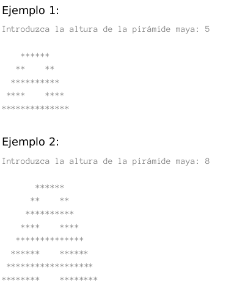

# EJERCICIO 1 (U2Ej1.java)

Realizar un programa que pinte una pirámide maya. Por los lados, se trata de una pirámide normal y corriente. Por el centro se van pintando líneas de asteriscos de forma alterna (empezando por la superior): la primera se pinta, la segunda no, la tercera sí, la cuarta no, etc. La terraza (la línea superior)  de la pirámide siempre tiene 6 asteriscos, por tanto, las líneas centrales que se añaden a la pirámide normal tienen 4 asteriscos y el espacio entre las líneas que no se pintan tiene también 4 asteriscos.

Se solicitará al usuario la altura hasta que el usuario introduza una altura mayor o igual que 3.

# EJERCICIO 2 (U2Ej3.java)

Escribir un programa que descifre números cifrados sabiendo que las correspondencia entre dígitos es la siguiente:

Se realizarán descifrados de números solicitados al usuario hasta que el usuario introduzca un número negativo.

0	1	2	3	4	5	6	7	8	9
0	3	4	5	6	7	8	9	2	1
Por ejemplo:

Introduzca un número a descrifrar: 1234

El número descrifrado es: 3456

Introduzca un número a descrifrar: 9200

El número descifrado es: 1400

Introduce un número a descifrar: -1

Hasta luego.

NOTA: No se pueden utilizar funciones de cadenas ni Arrays

# EJERCICIO 3 (U2Ej3.java)

Crear una aplicación que solicite una fecha (día, mes y año) en formato (dd/mm/yyyy) y muestre la fecha correspondiente al día siguiente. No tendremos en cuenta los años bisiestos, y supondremos correcta la fecha introducida tiene el formato correcto. Se solicitarán fechas hasta que el usuario introduzca FIN. Supondremos que el usuario siempre usa el formato correcto.

Nota para el que no se acuerde:

Enero, con 31 días
Febrero, con 28 días
Marzo, con 31 días
Abril, con 30 días
Mayo, con 31 días
Junio, con 30 días
Julio, con 31 días
Agosto, con 31 días
Septiembre, con 30 días
Octubre, con 31 días
Noviembre, con 30 días
Diciembre, con 31 días
Ejemplo:

-Dame un día, mes y año

05/12/2001

-El siguiente día es el 06/12/2001

Ejemplo 2:

-Dame un día,mes y año

31/12/2001

-El siguiente día es el 01/01/2002

- Dame un día,mes y año

FIN

Hasta luego