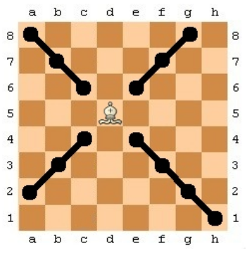

# EJERCICIO 1: (Ej1.java)

Crear un función llamada maxMatriz que:

Reciba como parámetro un vector de enteros bidimensional y
Devuelva el mayor elemento de esa matríz o vector bidimensional.
Para probar dicha función se solicitará al usuario el número de filas de la matriz y el número de columnas y se rellenará con enteros aleatorios entre 0 y 1000 dicha matriz (vector bidimensional).

# EJERCICIO 2: (Ej2.java)

Crear una función insertarValor que:

Reciba como parámetros un vector de enteros, un valor y una posición
Devuelva como resultado un vector en el que habremos insertado el valor que le hemos pasado en la posición indicada. De esta manera el vector resultado tendrá un elemento más.
Realizar una llamada a la función mostrando el vector resultado.

Ejemplo:
```javascript
v = { 1 , 2 , 3 , 4 , 5 }

v1 = invertarValor(v,8,3)

Entonces v1 será {1,2,3,8,4,5}
```

# EJERCICIO 3: (Ej3.java)

Escribe una programa que dado un tablero de ajedrez y una posición en el mismo de un alfil nos diga a qué casillas podría saltar un alfil que se encuentra en esa posición:

Las columnas de tablero se indican con letras de la "a" a la "h" y las filas se indican del 1 al 8.

Ejemplo:



Introduzca la posición del alfil: d5
El álfil puede moverse a las siguientes posiciones:
h1 a2 g2 b3 f3 c4 e4 c6 e6 b7 f7 a8 g8

# EJERCICIO 4: (Ej4.java)

Crea la función filtraPrimos que:

Recibe un array de enteros
Devuelve un array de enteros con todos los primos que se encuentran en el array origen
Obviamente el tamaño del array  que se devuelve será de una longitud menor o igual al que se pasa como parámetro. Para facilitar el ejercicio aunque un número primo se repita lo añadiremos al vector.Si no existe ningún número primo en el vector original , se devuelve un array con el número -1 como único elemento.

# EJERCICIO 5: (Ej5.java y VectoresExamen.java)

Realizar una librería para trabajar con vectores que haremos disposible en nuestor proyecto a través de la clase VectoresExamen. Dicha librería contendrá las siguientes funciones:

unir(v1,v2) que recibe dos vectores de cadenas y nos devuelve un vector de cadenas cuya longitud es la suma de las longitudes y que contiene primero los elementos de v2 y luego los elementos de v1
rotar(v1,num_pos) que recibe un vector y el número de posiciones a rotar y nos devuelve un vector desplazada hacia la derecha tantos elementos como posiciones le indiquemos.
Llamar desde la clase Ej5 una vez a cada una de las funciones de la librería.

Ejemplo:
```javascript
Si v1 = {"a","b","c"} y v2 = {"d","e","f"}

El resultado de unir(v1,v2) debe ser {""d","e","f","a","b","c"}

Si v1 = { "a","b","c","d","e","f"}

El resultado de rotar(v1,2) debe ser { "e","f" "a","b","c","d"}
```